# Documentation of LAMP-STACK-AWS-102-107
## AWS-102 : Setting up AWS account and Virtual Ubuntu 
### Created Aws account
 - Went to AWS home page.
 - Chose create an Aws account.
 - Entered email address in root user email address and got verified with  verification email.
 - Completed other set up process like ( Billing addresss, mastercard verification etc).
 - Finally, Aws free tier account created.
### Setting up virtual ubuntu server
- First, created an ec2 instance named it as "First-instance-aws" in a region "Ohio" with instance type "t2.micro", AMI (Amazon Machine Image ) as "ubuntu" security group and all other required configuration was selected as default here.
 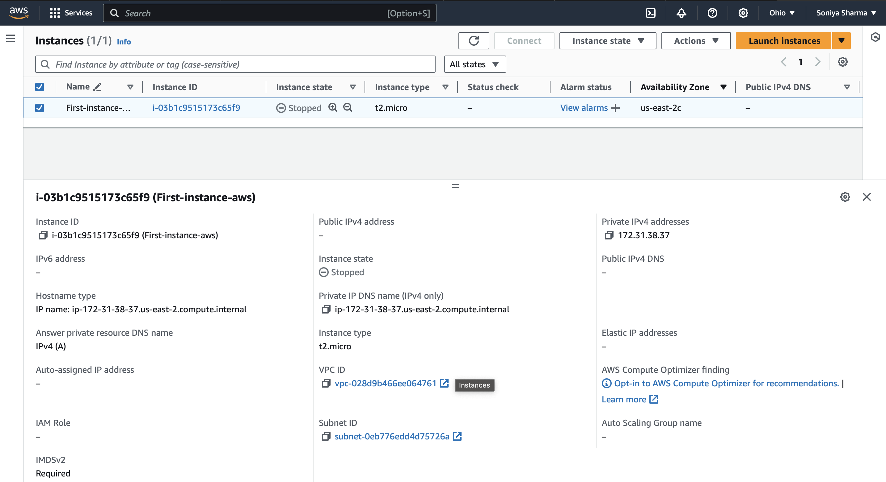
- Latest version of ubuntu was selected which is "Ubuntu Server 22.04 LTS (HVM)". An AMI is a template that contains the software configuration (operating system, application server, and applications) required to launch your instance.
 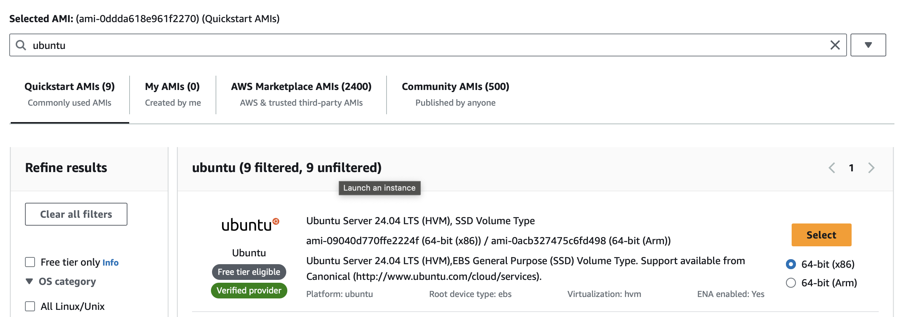
- Private key was generated and named it as "First-instance-private-key" and downloaded ".pem" file.
### Connecting virtual server to EC2 instance
Used the same private key previously downloaded to connect to EC2 instace via ssh:
- Created security group configuration adding ssh and updated this configuration to my ec2 instance to access  TCp port 22.
- Changed the permission for "First-Instance-Key.pem" file as

  ```
  chmod 400 "First-Instance-Key.pem"
  ```
- Connected to the instance as
  ```
  ssh -i "First-instance-private-key.pem" ubuntu@ec2-18-219-15-149.us-east-2.compute.amazonaws.com
  ```
  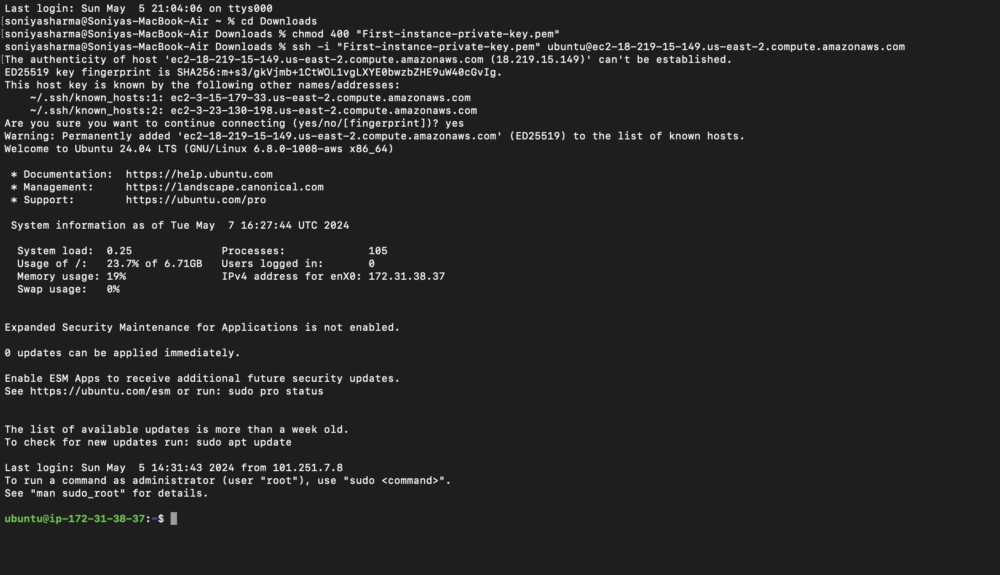

Conclusion, Linux Server in the cloud as created.

## AWS-103 : Installing apache and Updating the Firewall
- Apache was installed using Ubuntu's package manager 'apt'
  ```
  sudo apt update
  sudo apt install apache2
  ```
  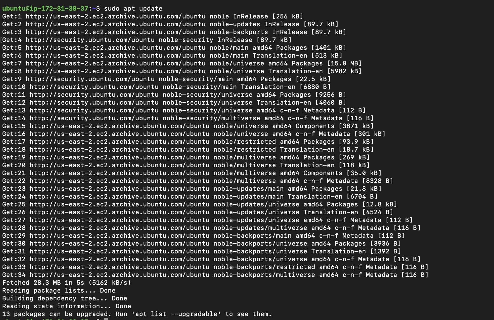
  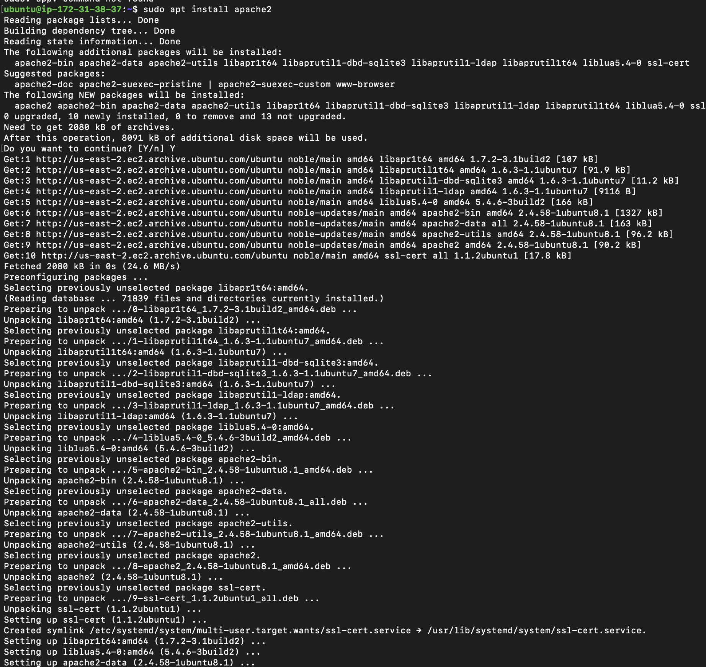

- Verified that apache2 is running as a service in ubuntu as
  ```
  sudo systemctl status apache2
  ```
  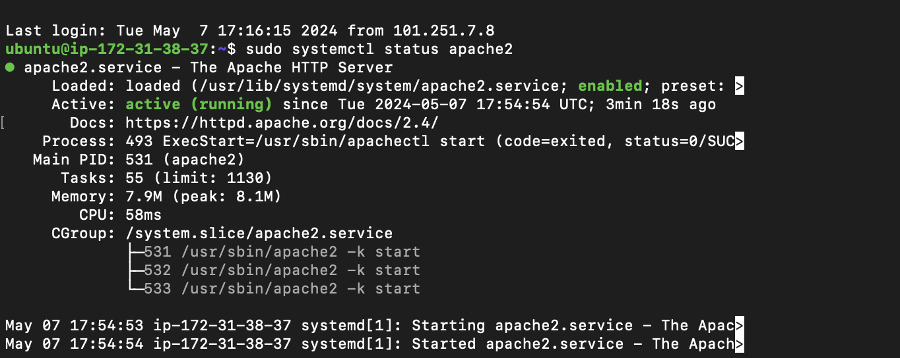

Conclusion, First WebServer had been launched.

- To recieve any traffic by my webserver, I need to open TCP port 80. Added TCP port 80 in security group inbound rules of my ec2 instance.
Note: TCP port 80 is the default port that web browsers use to access web pages on the internet 

#### We can access Webserver locally and from the internet.
- Checked how I can access it loaclly, by:
  ```
  curl http://localhost:80
  curl http://127.0.0.1:80
  ```
  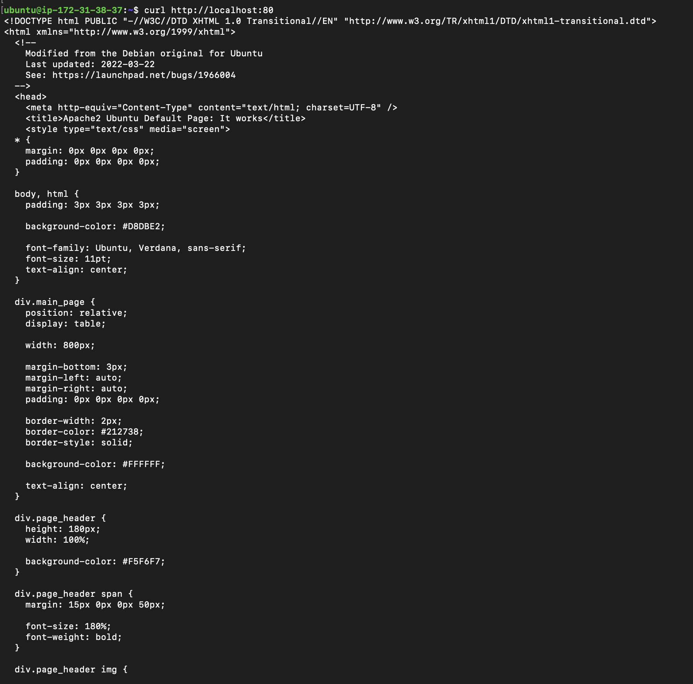

- Finally get access to Apache Ubuntu Default Page in our web browser that previously got by curl command with nice html formatting by web browser.

  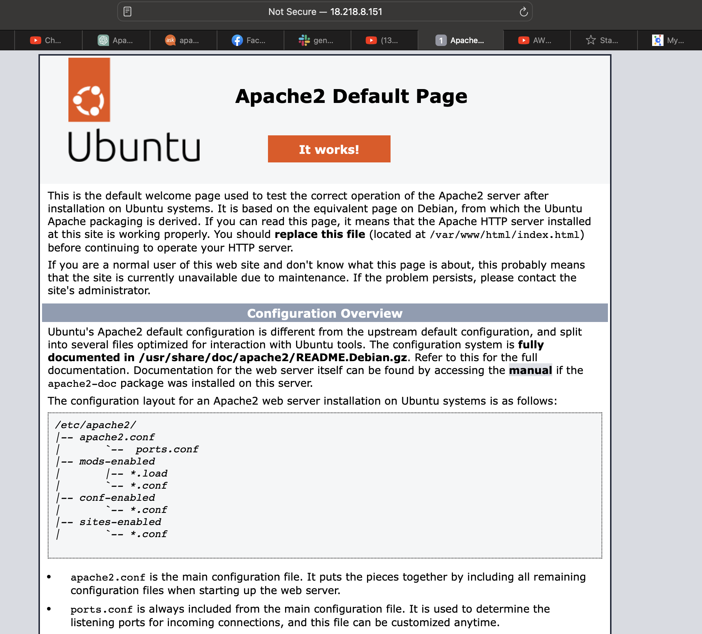

## AWS-104 : Installing MySQL
- Installed MySql by using
  ```
  sudo apt install mysql-server
  ```
- Set the MySql password 
  ```
   ALTERUSER 'root'@'localhost' IDENTIFIED WITH mysql_native_password BY 'place the password here';
  ```

  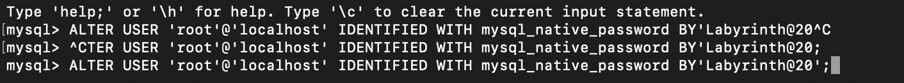

- Did mysql secure installation
  ```
  sudo mysql_secure_installation
  ```
- Then, Logged into mysql server running
  ```
  sudo mysql -p
  ```
- Exited from MySql
  ```
  exit
  ```

## Conclusion
Using all these command. MySQl server was installed and secured.

## AWS-105 : Installing PHP
- Installed php using command :
  ```
  sudo apt install php libapache2-mod-php php-mysql
  ```
- Confirming Php version
  ```
  php -v
  ```
  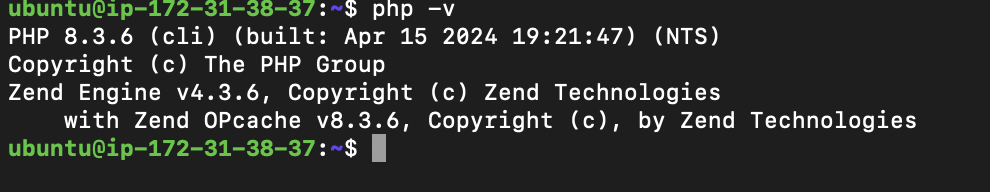

## Conclusion
LAMP stack is completely installed and fully operational.

## AWS-106 : Creating a Virtual Host for website using Apache
Virtual host allows us to have multiple websites loacated on a single machine and users of the websites will not even notice it. 
- Project "projectlamp"
  - Created the directory
    ```
    sudo mkdir /var/www/projectlamp
    ```
  - Assigned ownership of the directory with $USER environment variable
    ```
    sudo chown -R $USER:USER /var/www/projectlamp
    ```
  - Created and open a new configuration file in Apache's sites-available directory using vi.
    ```
    sudo vi /etc/apache2/sites-available/projectlamp.conf
    ```
  - Vim was be opened, went to insert mode pressing "i" on keyboard, wrote the following text:
    ```
    <VirtualHost *:80>
     ServerName projectlamp
     ServerAlias www.projectlamp
     ServerAdmin webmaster@localhost
     DocumentRoot ${APACHE_LOG_DIR}/error.log
     ErrorLog ${APACHE_LOG_DIR}/access.log combined
    </VirtualHost>
    ```
  - ESC button was pressed to come out of insert mode, typed ": wq" for save and quit and pressed enter.
  - ls command to show the new file in the sites-available directory:
    ```
    sudo ls /etc/apache2/sites-available
    ```
  - Used a2ensite command to enable the new virtual host:
    ```
    sudo a2ensite projectlamp
    ```
  - Apache's default configuration would overwrite our virtual host if we are not using a custom domain name. So, to disable Apache's default website used a a2dissite command.
    ```
    sudo a2dissite 000-default
    ```
  - To make sure configuration file doesn't contain syntax error:
    ```
    sudo apache2ctl configtest
    ```
  - Reloaded Apache so these changes effect:
    ```
    sudo systemctl reload apache2
    ```
    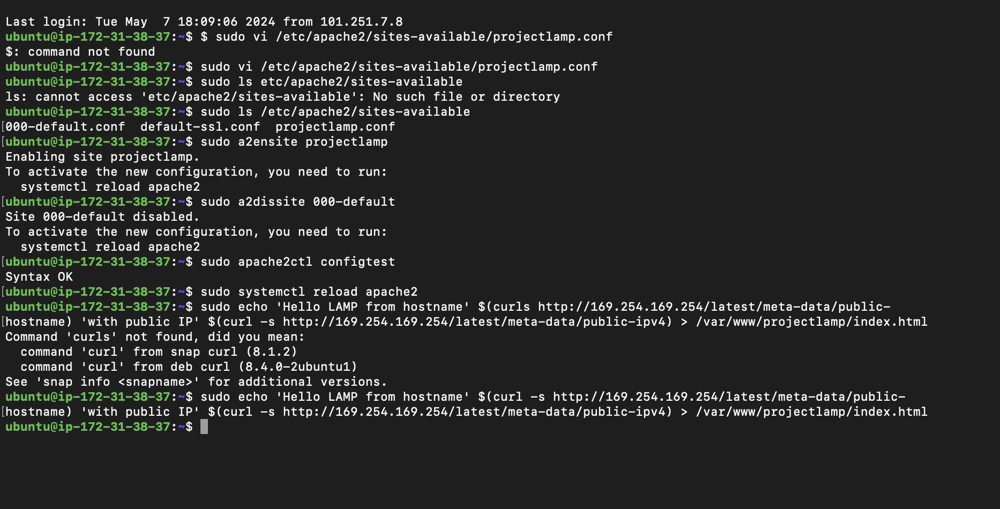

  Note: New website was active but the web root was empty. So, created an index.html to test virtual host works as expected.
    ```
    sudo echo 'Hello LAMP from hostname' $(curl -s http://169.254.169.254/latest/meta-data/public-
    hostname) 'with public IP' $(curl -s http://169.254.169.254/latest/meta-data/public-ipv4) > /var/www/projectlamp/index.html
    ```
  - Went to browser and open the URL using public ip address of ec2 instance.
    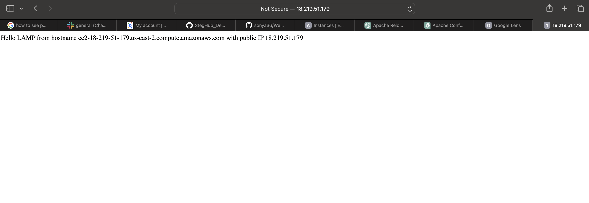
 
 ## AWS- 107 : Enable PHP on the website
 - Editing the /etc/apache2/mods-enabled/dir.conf file and changed the order in which the index.php file is listed within DirectoryIndex directive:
    ```
    sudo vim /etc/apache2/mods-enabled/dir.config
    ```
    ```
    <IfModule mod_dir.c>
    # Change this:
    # DirectoryIndex index.html index.cgi index.pl index.php index.xhtml index.htm
    # To this:
    DirectoryIndex index.php index.html index.cgi index.pl index.xhtml index.htm
    </IfModule>
    ```

 - Need to reload Apache so the changes take effect:
    ```
    sudo systemctl reload apache2
    ```
 - Creating a PHP script to test that PHP is correctly installed and configured in server:
    ```
    vim /var/www/projectlamp/index.php
    ```
 - Added following text:
    ```
    <?php
    phpinfo();>
    ```
    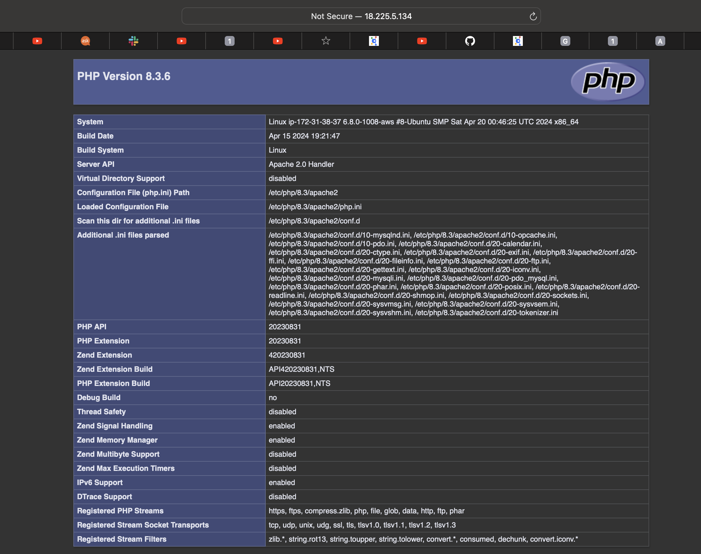

 - Removed the created file :
    ```
    sudo rm /var/www/projectlamp/index.php
    ```
    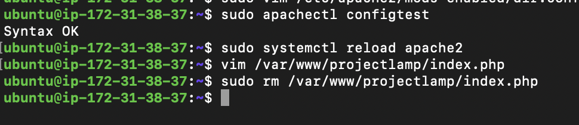

## Conclusion
Deployed a LAMP stack website in AWS cloud.


